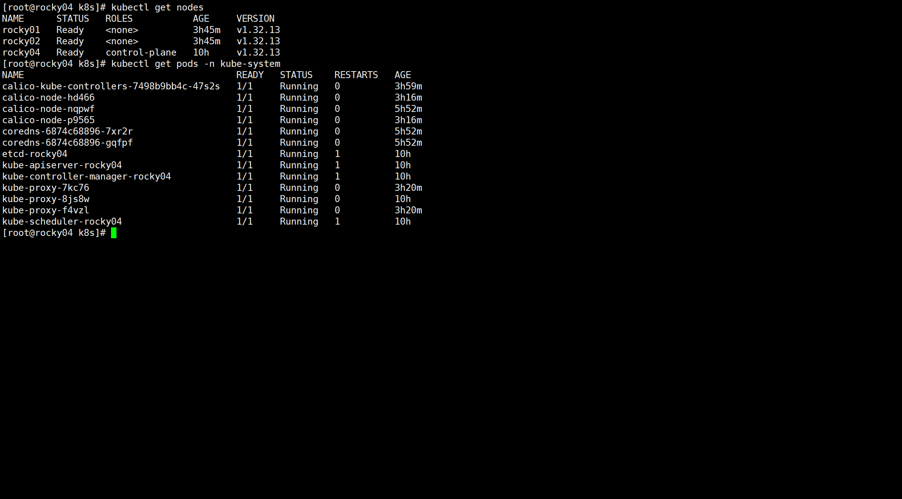
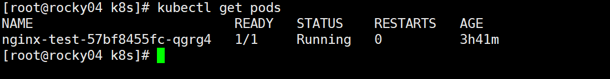
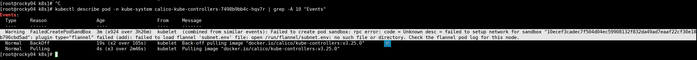

# 配置

```
master:
rocky04 192.168.31.105 rocky04
nodes
rocky04 192.168.31.104 rocky01
rocky04 192.168.31.102 rocky02
```

# 问题
## 1.k8s系统pods启动失败
**k8s弃用docker改用crt拉取镜像**
- 1.20 版本（2020 年底）：宣布 dockershim 弃用，开始打印警告日志
- 1.24 版本（2022 年 5 月）：正式从 kubelet 中移除 dockershim，这是关键分界点
- 1.24 之后：默认推荐使用 containerd 或 CRI-O 作为容器运行时

基本上全是因为crt拉取镜像超时，导致k8s的system pods启动超时。  
k8s目前1.24版本及以后默认使用crt拉取镜像，经实测，国内无论是修改镜像源还是直接拉取基本上都会超时无法拉取，  
目前唯一解决方案是直接通过docker拉取，然后用docker save 保存为tar压缩包，然后再用crt导入。  
**注意**  
crt导入镜像包后，如果拉取的不是官方镜像，基本上就会启动失败，因为k8s启动的时候默认是读取的官方镜像名称，需要通过crt tag 把拉取的镜像重新命名  

**相关命令**  
`kubectl get pods -n kube-system // 查看k8s系统pods 去掉kube-system就是查看pods`
  
  

`kubectl describe pod -n kube-system calico-node-hd466| grep -A 10 "Events"// 查看每个pod具体报错`  
  


```
docker save -o <压缩包名称> <镜像名称>
ctr -n k8s.io images import nginx.tar // crt导入nginx的镜像
ctr -n k8s.io images tag <原镜像> <新镜像> // crt重新命名镜像
ctr -n k8s.io images ls | grep <镜像名> // crt查看镜像
```

# 总结
本次安装是依照教学视频+AI的方式进行安装，总共耗时估计为6个小时左右。得出以下结论：  
1. 但凡是AI给的镜像源之类的链接，99%都是乱编的，根本拉不下来。
2. 在遇见crt拉取超时的问题时，已经明确告诉AI多次，但是还是会给出乱编的镜像源让你去拉取，还是需要自己搜索解决方案
3. 在启动k8s的系统pods时，明明是因为缺少对应的镜像源导致启动失败，AI还是会给你虚假的镜像源让你重新拉取
4. AI目前最好是只按照它给的思路，具体问题还是需要查日志来进行排查，而且报错日志发给AIAI多半也是乱编解决方案，本次安装大部分时间都浪费在用AI乱编的解决方案上了